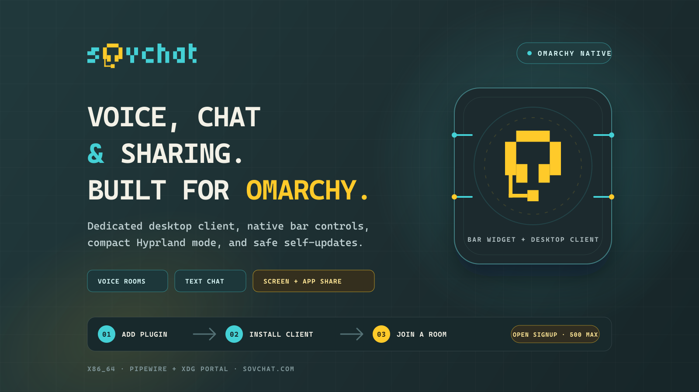

# SovChat for Omarchy

Voice rooms, text chat, and screen or application sharing in a dedicated
Omarchy desktop client, controlled from a native bar widget.

[Create an account](https://sovchat.com/signup) ·
[Open the web app](https://sovchat.com/app) ·
[Latest Omarchy client](https://github.com/Sovcat0608/sovchat-omarchy/releases/latest) ·
[Marketplace listing](https://plugins.omarchy.org/plugin.html?id=com.sovchat.omarchy)

> [!IMPORTANT]
> Anyone can create a SovChat account while capacity remains. Registration stops
> automatically at the server-enforced global limit of 500 accounts; no access
> code or separate Omarchy grant is required. The plugin cannot bypass that
> limit.

## What you get

- Voice rooms with dedicated microphone and speaker controls
- Text chat alongside the room
- Monitor and application-window sharing through Omarchy's desktop portal
- A native bar widget for install, status, launch, focus, and updates
- Compact Hyprland scratchpad behavior
- A dedicated Omarchy client and stable update channel

## Quick start

1. Install and enable the official plugin:

   ~~~bash
   omarchy plugin add https://github.com/Sovcat0608/sovchat-omarchy-plugin.git --enable
   ~~~

2. Open **SovChat** from the Omarchy bar and choose **Install client**. The
   widget downloads the reviewed x86_64 AppImage (about 129 MB) into your
   account's `~/.local` directory.

3. Launch SovChat, create an account or sign in, and join a room.
   Choose the share control in the desktop client when you want to present a
   monitor or application window.

Prefer the browser for a quick look? Create an account or sign in by choosing
**Open web app** in the widget or visiting [sovchat.com/app](https://sovchat.com/app).

## Requirements and limits

- Omarchy Quattro with third-party plugin support
- x86_64 hardware
- A SovChat account; open signup remains available until the server-enforced
  500-account limit is reached
- `bash`, Python 3, and `curl` for the user-level installer
- PipeWire and an XDG Desktop Portal for monitor/window selection
- Optional `fuse2` support when the AppImage runtime is not already available

The plugin and client run as the signed-in user. They do not request
administrator privileges or modify system configuration.

Linux system audio is intentionally not included with a screen share. SovChat
shares the selected monitor or application video while your configured
microphone continues to handle voice.

## Updates

Update the plugin checkout with:

~~~bash
omarchy plugin update --yes
~~~

The installed AppImage checks SovChat's Omarchy-only stable feed shortly after
launch, hourly, and after resume or unlock. It downloads an available update in
the background and presents **Update now** when the verified package is ready.

Upgrading from marketplace plugin 0.1.3 or earlier

Plugin 0.1.3 and earlier installed the standalone Linux client, which uses a
different update channel. Plugin 0.1.4 detects only that exact legacy target
and shows **Standalone found**.

Choose **Install Omarchy edition** to install the independent client alongside
it. The legacy AppImage is not opened, executed, changed, or removed. After the
Omarchy edition works, you may remove the old client separately using the
legacy commands below.

The standalone Linux update feed must not be redirected to the Omarchy feed.

## Security

The installer accepts one reviewed, immutable HTTPS artifact and verifies its
exact byte count and SHA-512 digest before atomic publication. It refuses
redirects, bounds download time and size, and protects destination paths from
symlink and concurrent-replacement attacks.

The plugin never reads SovChat credentials, browser storage, voice tokens, or
sessions. See [SECURITY.md](SECURITY.md) for its permissions, installed paths,
network boundary, and vulnerability-reporting process.

## Remove

Remove the Omarchy plugin:

~~~bash
omarchy plugin remove com.sovchat.omarchy --yes
~~~

The desktop client is deliberately retained. To remove it too, close SovChat
and delete only its owned user-level targets:

~~~bash
rm -rf -- "$HOME/.local/opt/sovchat-omarchy"
rm -f -- "$HOME/.local/share/applications/com.sovchat.omarchy.desktop"
rm -f -- "$HOME/.local/share/icons/hicolor/scalable/apps/com.sovchat.omarchy.svg"
~~~

If you migrated from marketplace plugin 0.1.3 or earlier, the standalone client
may remain beside the Omarchy edition. After confirming the Omarchy edition
works, remove that legacy installation separately:

~~~bash
rm -rf -- "$HOME/.local/opt/sovchat"
rm -f -- "$HOME/.local/share/applications/com.sovchat.desktop.desktop"
rm -f -- "$HOME/.local/share/icons/hicolor/scalable/apps/com.sovchat.desktop.svg"
~~~

Do not run the legacy cleanup commands for a separately managed Linux client.

## Learn more

- [Plugin changelog](CHANGELOG.md)
- [Desktop client source and releases](https://github.com/Sovcat0608/sovchat-omarchy)
- [Development and release handover](https://github.com/Sovcat0608/sovchat-omarchy/blob/main/HANDOVER.md)
- [MIT License](LICENSE)
